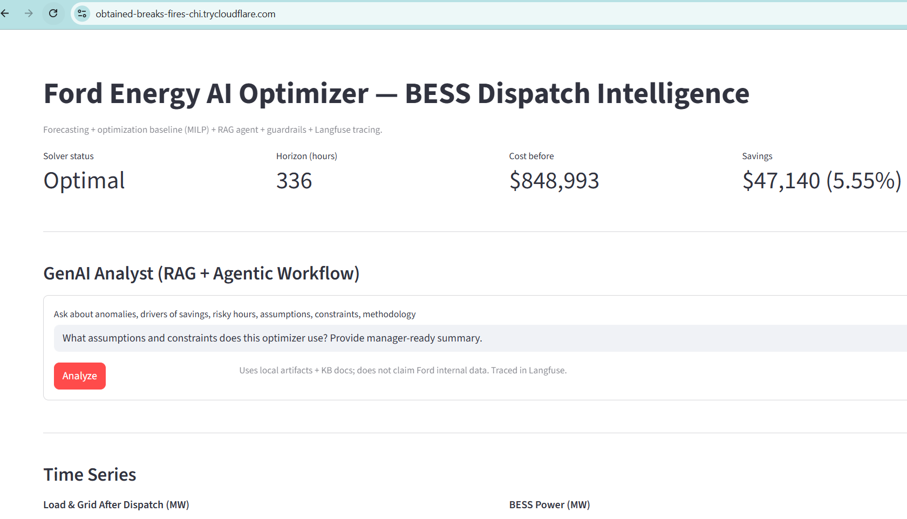
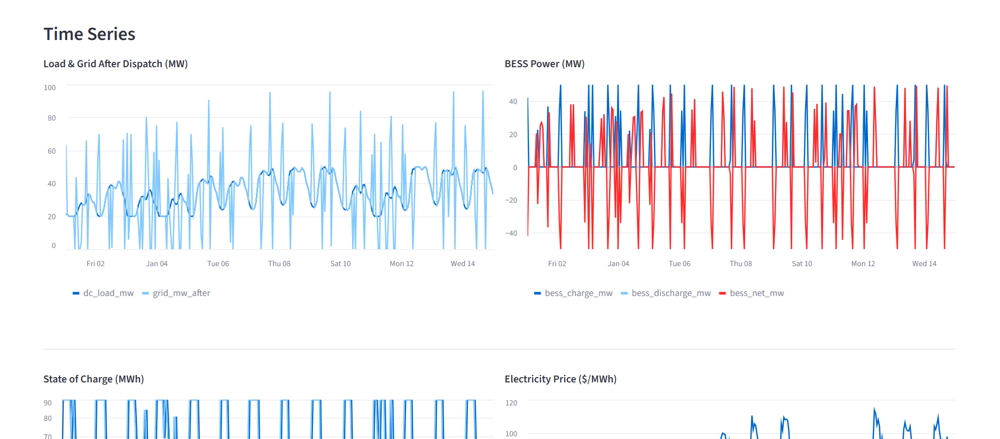
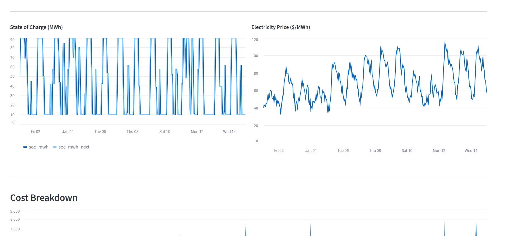
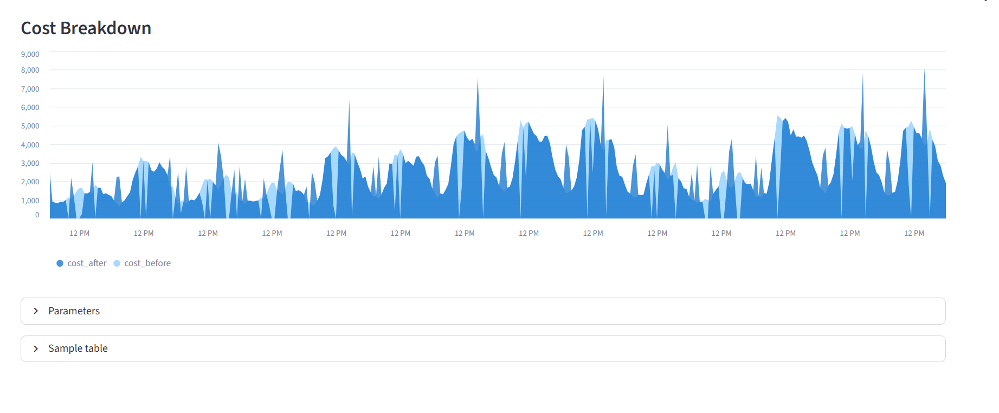
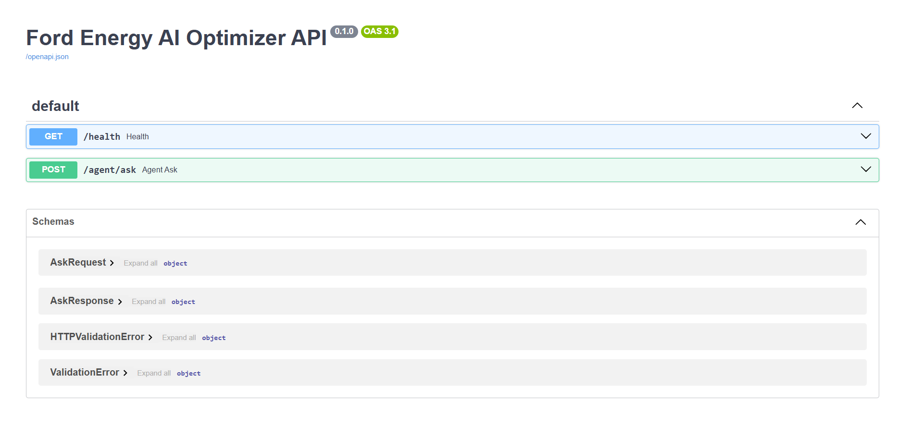
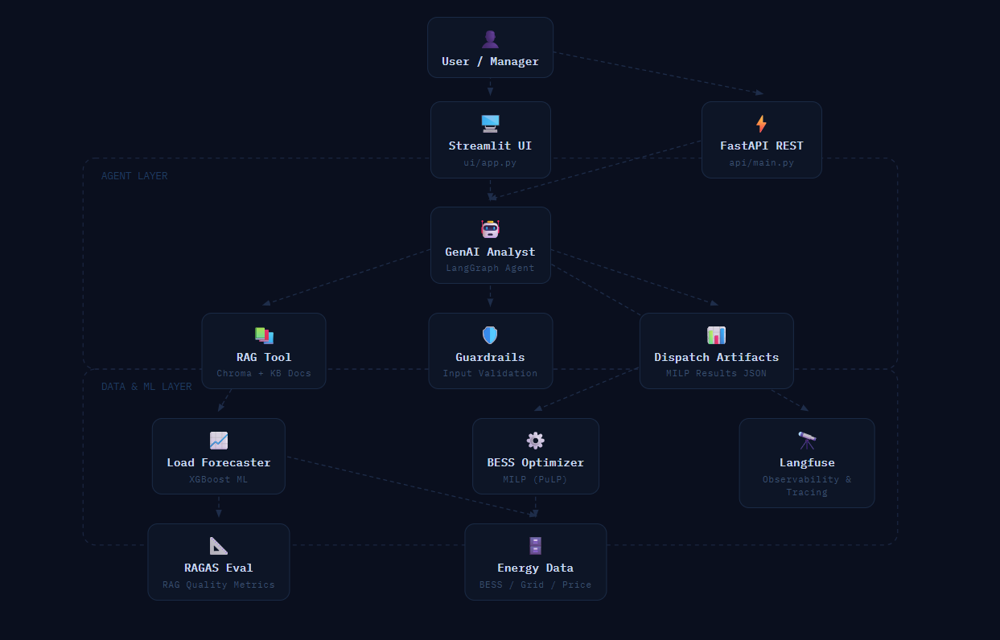
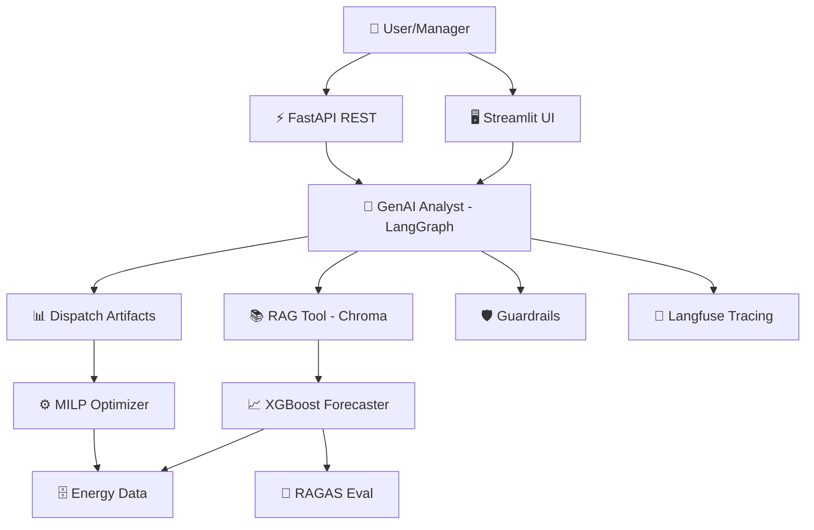

# Ford Energy AI Optimizer — BESS Dispatch Intelligence

> End-to-end AI prototype built around Ford Energy's Battery Energy Storage System (BESS) business.  
> Directly aligned with the Ford GDIA AI Engineer role requirements.

---

## What This Solves

Ford Energy is scaling BESS deployments for data centers. This system optimizes **when to charge and discharge** batteries to minimize electricity costs — saving **$47,140 (5.55%)** over a 336-hour horizon in simulation.

---

## Live Demo Screenshots

### Dashboard Overview — MILP Optimizer Results


### Time Series — Load, Grid, and BESS Power Dispatch


### State of Charge & Electricity Price Tracking


### Cost Breakdown — Before vs After Dispatch


### REST API — FastAPI with OpenAPI Docs


---

## Tech Stack

| Layer | Technology |
|---|---|
| Forecasting | XGBoost, Scikit-learn |
| Optimization | MILP (PuLP) |
| GenAI Agent | LangGraph + LangChain + OpenAI |
| RAG | Chroma Vector DB |
| Observability | Langfuse tracing |
| Evaluation | RAGAS framework |
| API | FastAPI |
| UI | Streamlit |
| Containerization | Docker + Docker Compose |
| Cloud-ready | GCP / AWS compatible |

---

## Architecture





---

## Modules

- **ML Load Forecasting** — XGBoost model predicting data center energy demand
- **BESS Dispatch Optimizer** — MILP solver deciding charge/discharge schedule to minimize cost
- **GenAI Analyst** — Agentic RAG workflow explaining anomalies and giving manager-ready insights
- **Observability** — Full Langfuse tracing of every agent reasoning step
- **RAG Evaluation** — RAGAS metrics on retrieval quality

---

## Local Run

​```bash
pip install -e .
python -m energy_ai.data.make_dataset
python -m energy_ai.optimizer.run_dispatch
python -m energy_ai.data.build_kb
streamlit run src/energy_ai/ui/app.py
​```

**API:**
​```bash
uvicorn energy_ai.api.main:app --host 0.0.0.0 --port 8000
​```

**Docker:**
​```bash
docker compose up
​```

**RAG Eval:**
​```bash
python -m energy_ai.eval.run_rag_eval
​```

---

## Alignment to Ford GDIA Role

| Job Requirement | This Project |
|---|---|
| Agentic AI workflows (LangGraph) | ✅ LangGraph agent with tool use |
| RAG pipelines | ✅ Chroma + KB docs + citations |
| ML models (supervised) | ✅ XGBoost load forecasting |
| Observability (Langfuse) | ✅ Full trace logging |
| Guardrails & input validation | ✅ Implemented |
| RAGAS evaluation | ✅ eval/run_rag_eval.py |
| Python + FastAPI | ✅ Production API |
| Cloud-ready deployment | ✅ Docker + GCP/AWS compatible |

---

*Motivated by Ford's expansion into energy AI, this project was built to deepen hands-on expertise in agentic systems, BESS optimization, and production-grade ML. Uses open datasets and public APIs only — no Ford internal data.*
